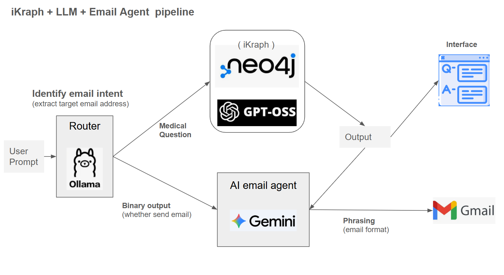
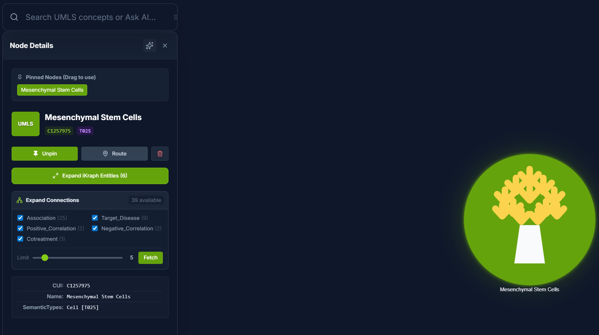
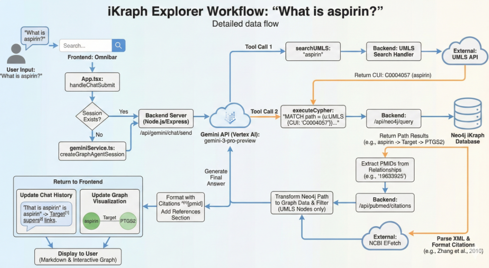

# iKLLM_Email_Agent
pipeline with local iKraph, LLM, email_agent

### Main Goal
When user ask a question to iKraph with email sending request, the Router divide it into pure medical question (for iKraph) and email intent (for Email Agent). The LLM will make response to medical question and also email the content to target address.
e.g. "What is the application of Panadol? Please send the answer to eric85021811@gmail.com."

  

We have our local iKraph (Neo4j-based) database

  

Workflow for handling medical question

  

---
